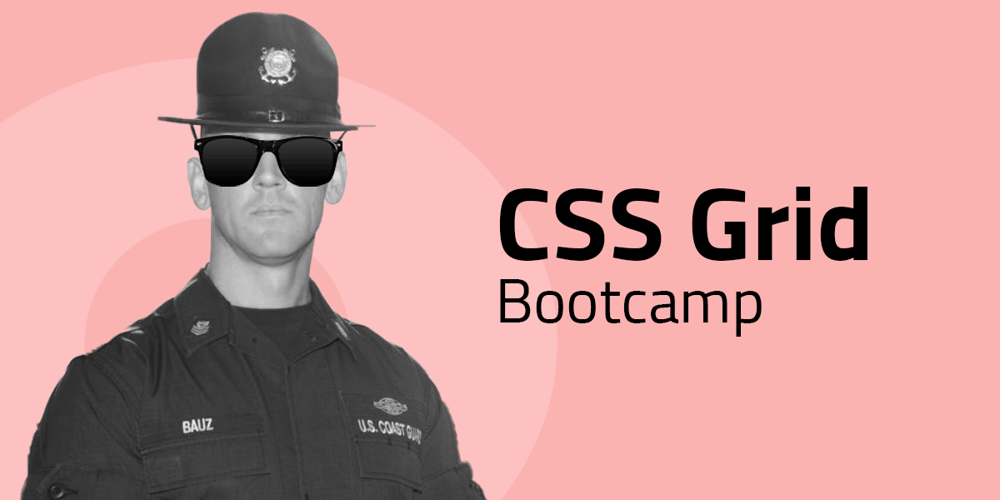

# CSS Grid Bootcamp

## 00. Grid dices

Använd endast HTML och CSS med ett grid för att göra en tärnings 6 olika sidor.

Gridsystemet bör vara uppsatt enligt skissed nedan.

| Bokstav | teknik     |
| ------- | ---------- |
| **A**   | static     |
| **B**   | grid areas |


Förslag på html-struktur:

```html
<article class="dice dots-6">
    <aside></aside>
    <aside></aside>
    <aside></aside>
    <aside></aside>
    <aside></aside>
    <aside></aside>
</article>
```

## Samma layout, olika tekniker

**Static grid** kallas det när _grid-items_ placeras ut i grid-systemet med exakta positioner. Här använder man sig av grid-column-start, grid-column-end, grid-row-start och grid-row-end, eller förkortningarna grid-column och grid-row. Ex.

```css
.grid-item {
    grid-column: 3 / 4;
    grid-row: 1 / 2;
}
```

**Flow grid** kallas det när _grid-items_ placeras ut i grid-systemet efter ett flöde. Istället för att tala om _var_ grid-item ska ligga, så låter man dem följa gridflödet och istället ange dess storlek, dvs. de kolumner och rader som ska tas upp. Ex.

```css
.grid-item {
    grid-column: auto / span 2;
    grid-row: auto / span 1;
}
```

**Grid areas** är ett tredje sätt att layouta med hjälp av grid som lägger man all layyoutinformation i _grid-containern_. Du namnger varje grid-item, och talar sedan i grid-containern om var den ska ligga med hjälp av strängar. Ex.

```css
.grid-container {
    grid-template-areas: "topbar topbar topbar";
    grid-template-rows: 4rem;
}

.grid-item {
    grid-area: "topbar";
}
```

## 01. Golden layout

| Bokstav | teknik     |
| ------- | ---------- |
| **A**   | static     |
| **B**   | flow       |
| **C**   | grid areas |


## 02. Dynamic layout

**Dynamic layout** är en grid-baserad layout som innehåller en _dynamisk yta_, d.v.s en yta som ska kunna växa / minska med innehållet i den.

De dynamiska ytorna visas med en _bakgrundsfärg_ i wireframen.

| Bokstav | teknik     |
| ------- | ---------- |
| **A**   | flow       |
| **B**   | grid areas |


## 03. Complex Dynamic layout

**Complex dynamic layout** är en grid-baserad layout som innehåller flera _dynamiska ytor_, d.v.s ytor som ska kunna växa / minska med innehållet i dem.

De dynamiska ytorna visas med en _bakgrundsfärg_ i wireframen.

| Bokstav | teknik     |
| ------- | ---------- |
| **A**   | flow       |
| **B**   | grid areas |


## 04. Static Calendar

Du ska med HMTL och CSS koda upp denna kalendermockup så pixelperfekt som möjligt.

Tekniker du ska använda dig av är:

-   CSS grid
-   Stoppa gärna in lite flexbox också. Var passar det bäst?


